# 创建型模式

创建型模式关注的是对象的创建，将创建对象的过程进行抽象和封装，分离了对象的创建和使用。客户只需要使用，而不关心创建过程中的逻辑。

## 创建型模式的特点

- 客户不知道对象的具体类是什么
- 隐藏了对象的实例是如何被创建的

## 创造型模式包括

- [简单工厂模式（simple factory）](#-简单工厂模式-静态工厂方法-)
- [工厂方法模式（factory method）](#工厂方法模式)
- [抽象工厂模式（abstract factory）](#抽象工厂模式)
- [建造者模式（builder）](#建造者模式)
- [原型模式（prototype）](#原型模式)
- [单例模式（singleton）](#单例模式)

---

# 简单工厂模式（静态工厂方法）

可以根据参数的不同返回不同类的实例。简单工厂模式专门定义了一个类来负责创建其他类的实例，被创建的实例通常有共同的父类。   

## 模式结构

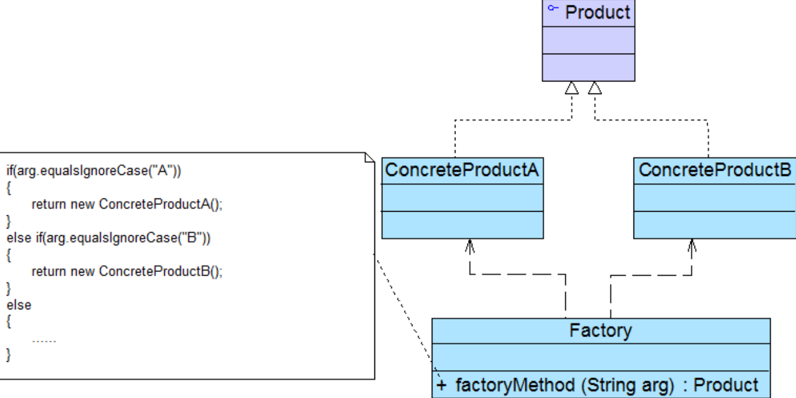

- Factory：工厂角色，负责实现创建所有实 例的内部逻辑
- Product：抽象产品角色，是所创建的所有对象的父类，负责描述所有实例所共有的公共接口
- ConcreteProduct：具体产品角色是创建目标，所有创建的对象都充当这个角色的某个具体类的实例

## 模式分析

- 将对象的创建和对象本身业务处理分离可以降低系统的耦合度， 使得两者修改起来都相对容易。
- 由于工厂方法是静态方法，使用起来很方便，可通过类名直接调用
- 最大的问题在于工厂类的职责相对过重，增加新的产品需要修改工厂类的判断逻辑，这一点与开闭原则是相违背
- 要点在于：当你需要什么，只需要传入一个正确的参数，就可以获取你所需要的对象，而无须知道其创建细节。

## 模式优缺点

### 优点

- 实现了对责任的分割，它提供了专门的工厂类用于创建对象。
- 客户端无须知道所创建的具体产品类的类名，只需要知道具体产品类所对应的参数即可。
- 通过引入配置文件，可以在不修改任何客户端代码的情况下更换和增加新的具体产品类。

### 缺点

- 工厂类集中了所有产品创建逻辑，一旦不能正常工作，整个系统都要受到影响。
- 使用简单工厂模式将会增加系统中类的个数，在一定程序上增加了系统的复杂度和理解难度。
- 系统扩展困难，一旦添加新产品就不得不修改工厂逻辑
- 式由于使用了静态工厂方法，造成工厂角色无法形成基于继承的等级结构。

## 适用环境

- 工厂类负责创建的对象比较少
- 客户端只知道传入工厂类的参数，对于如何创建对象不关心

## 模式简化

有时候可以直接把工厂类的功能写到抽象产品里。

---
# 工厂方法模式

工厂方法模式(Factory Method Pattern)又称为**工厂模式**，也叫**虚拟构造器**(VirtualConstructor)模式或者多态工厂(Polymorphic Factory)模式。在工厂方法模式中，工厂父类负责定义创建产品对象的公共接口，而工厂子类则负责生成具体的产品对象，这样做的目的是将产品类的实例化操作延迟到工厂子类中完成，即通过工厂子类来确定究竟应该实例化哪一个具体产品类。

## 模式动机

如果需要增加一种新类型，那么除了增加一个新的 具体产品类之外，还需要修改工厂类的代码，这就使得整个设计在一定程度上违反了“开闭原则”。   

## 模式结构

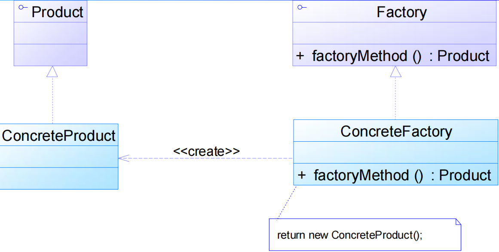

- Product：抽象产品
- ConcreteProduct：具体产品
- Factory：抽象工厂
- ConcreteFactory：具体工厂

## 模式分析

- 在工厂方法模式中，核心的工厂类不再负责所有产品的创建，而是将具体创建工作交给子类去做。
- 工厂方法模式可以允许系统在不修改工厂角色的情况下引进新产品。
- 当系统扩展需要添加新的产品对象时，仅仅需要添加一个具体产品对象以及一个具体工厂对象，原有工厂对象不需要进行任何修改，也不需要修改客户端，很好地符合了“开闭原则”。
 
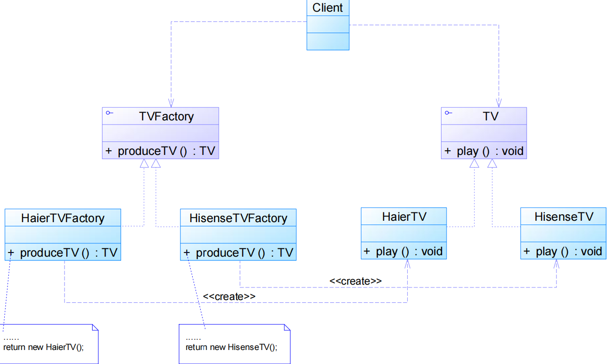

## 模式优缺点

### 模式优点

- 在工厂方法模式中，工厂方法用来创建客户所需要的产品，同时还向客户隐藏了哪种具体产品类将被实例化这一细节，用户只需要关心所需产品对应的工厂，无须关心创建细节，甚至无须知道具体产品类的类名
- 基于工厂角色和产品角色的多态性设计是工厂方法模式的关键。它能够使工厂可以自主确定创建何种产品对象，而如何创建这个对象的细节则完全封装在具体工厂内部。
- 使用工厂方法模式的另一个优点是在系统中加入新产品时，无须修改抽象工厂和抽象产品提供的接口，无须修改客户端，也无须修改其他的具体工厂和具体产品，而只要添加一个具体工厂和具体产品就可以了。

### 模式缺点

- 在添加新产品时，需要编写新的具体产品类，而且还要提供与之对应的具体工厂类，系统中类的个数将成对增加，在一定程度上增加了系统的复杂度，有更多的类需要编译和运行，会给系统带来一些额外的开销。
- 由于考虑到系统的可扩展性，需要引入抽象层，在客户端代码中均使用抽象层进行定义，增加了系统的抽象性和理解难度，且在实现时可能需要用到DOM、反射等技术，增加了系统的实现难度。

## 适用环境

- 一个类不知道它所需要的对象的类：在工厂方法模式中，客户端不需要知道具体产品类的类名，只需要知道所对应的工厂即可，具体的产品对象由具体工厂类创建；客户端需要知 道创建具体产品的工厂类。
- 一个类通过其子类来指定创建哪个对象：在工厂方法模式中，对于抽象工厂类只需要提供一个创建产品的接口，而由其子类来确定具体要创建的对象，利用面向对象的多态性和里氏 代换原则，在程序运行时，子类对象将覆盖父类对象，从而使得系统更容易扩展。
- 将创建对象的任务委托给多个工厂子类中的某一个，客户端在使用时可以无须关心是哪一个工厂子类创建产品子类，需要时再动态指定，可将具体工厂类的类名存储在配置文件或数据库中。

## 模式拓展

- 使用多个工厂方法：在抽象工厂角色中可以定义多个工厂方法，从而使具体工厂角色实现这些不同的工厂方法，这些方法可以包含不同的业务逻辑，以满足对不同的产品对象的需求。
- 产品对象的重复使用：工厂对象将已经创建过的产品保存到一个集合（如数组、List等）中，然后根据客户对产品的请求，对集合进行查询。如果有满足要求的产品对象，就直接将该产品返回客户端；如果集合中没有这样的产品对象，那么就创建一个新的满足要求的 产品对象，然后将这个对象在增加到集合中，再返回给客户端。
- 多态性的丧失和模式的退化：如果工厂仅仅返回一个具体产品对象，便违背了工厂方法的用意，发生退化，此时就不再是工厂方法模式了。当只有一个具体工厂，在具体工厂中可以创建所有的产品对象，并且工厂方法设计为静态方法时，工厂方法模式就退化成简单工厂模式

---
# 抽象工厂模式

抽象工厂模式(Abstract Factory Pattern)：提供一个创建一系列相关或相互依赖对象的接口，而 无须指定它们具体的类。抽象工厂模式又称为Kit模式，属于对象创建型模式。

## 模式动机

有时候我们需要一个工厂可以提供多个产品对象，而不是单一的产品对象。

### 产品等级结构和产品簇

- 产品等级结构：产品等级结构即产品的继承结构
- 产品族：在抽象工厂模式中，产品族是指由同一个 工厂生产的，位于不同产品等级结构中的一组产品

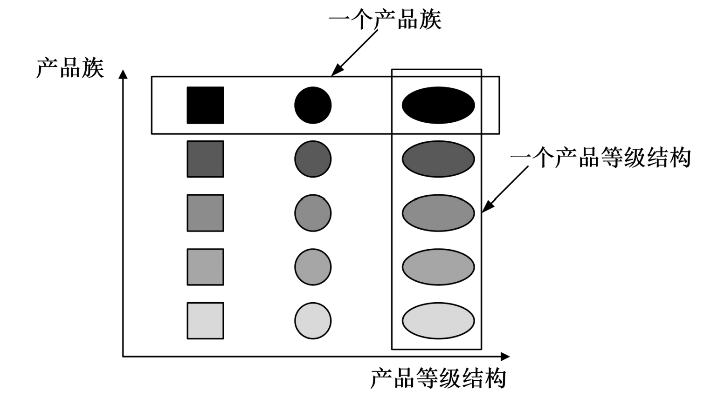

- 当系统所提供的工厂所需生产的具体产品并不是一个简单的对象，而是多个位于不同产品等级结构中属于不同类型的具体产品时需要使用抽象工厂模式。
- 抽象工厂模式是所有形式的工厂模式中最为抽象和最具一般性的一种形态。
- 工厂方 法模式针对的是一个产品等级结构，而抽象工厂模式则需要面对多个产品等级结构，一个工厂等级结构可以负责多个不同产品等级结构中的产品对象的创建。（一个工厂可以生产一个产品族）

## 模式结构

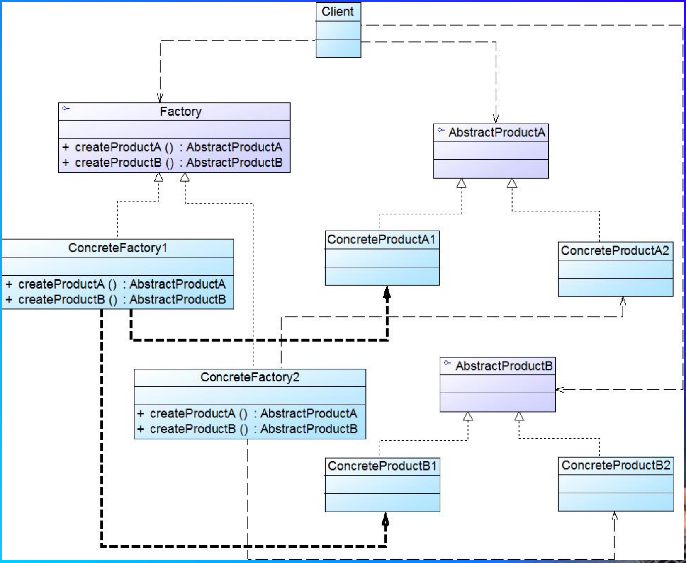

- AbstractFactory：抽象工厂
- ConcreteFactory：具体工厂
- AbstractProduct：抽象产品
- Product：具体产品

## 模式优缺点

### 模式优点

- 抽象工厂模式隔离了具体类的生成，使得客户并不需要知道什么被创建。由于这种隔离，更换一个具体工厂就变得相对容易。
- 抽象工厂模式可以实现高内聚低耦合的设计目的
- 当一个产品族中的多个对象被设计成一起工作时，它能够保证客户端始终只使用同一个产品族中的对象。
- 增加新的具体工厂和产品族很方便，无须修改已有系统，符合“开闭原则”。

### 模式缺点

- 难以扩展抽象工厂来生产新种类的产品，这是因为在抽象工厂角色中规定了所有可能被创建的产品集合
- 开闭原则的倾斜性（增加新的工厂和产品族容易，增加新的产品等级结构麻烦）

## 适用环境

- 系统中有多于一个的产品族，而每次只使用其中某一产品族。
- 属于同一个产品族的产品将在一起使用，这一约束必须在系统的设计中体现出来。
- 系统提供一个产品类的库，所有的产品以同样的接口出现，从而使客户端不依赖于具体实现。

## 模式扩展

### 开闭原则的倾斜性

- 增加产品族：对于增加新的产品族，工厂方法模式很好的支持了“开闭原则”，对于新增加的产品族，只需要对应增加一个新的具体工厂即可，对已有代码无须做任何修改。
- 增加新的产品等级结构：对于增加新的产品等级结构，需要修改所有的工厂角色，包括抽象工厂类，在所有的工厂类中都需要增加生产新产品的方法，不能很好地支持“开闭原则”。

**抽象工厂模式的这种性质称为“开闭原则”的倾斜性，抽象工厂模 式以一种倾斜的方式支持增加新的产品，它为新产品族的增加 提供方便，但不能为新的产品等级结构的增加提供这样的方便。**

### 工厂模式的退化

当抽象工厂模式中每一个具体工厂类只创建一个产品对象，也就是只存在一个产品等级结构时，抽象工厂模式退化成工厂方法模式；当工厂方法模式中抽象工厂与具体工厂合并，提供一个统一的工厂来创建产品对象，并将创建对象的工厂方法设计为静态方法时，工厂方法模式退化成简单工厂模式。

# 建造者模式
建造者模式(Builder Pattern)：将一个复杂对象的构建与它的表示分离，使得同样的构建过程可以创建不同的表示。   

建造者模式是一步一步创建一个复杂的对象，它允许用户只通过指定复杂对象的类型就可以构建它们，用 户不需要知道内部的具体构建细节。建造者模式属于对象创建型模式。根据中文翻译的不同，建造者模式 又可以称为生成器模式。

## 模式动机

无论是在现实世界中还是在软件系统中，都存在一些复杂的对象，它们拥有多个组成部分，**建造者模式 可以将部件和其组装过程分开，一步一步创建一个复杂的对象**。  

建造者返还给客户端的是一个 已经建造完毕的完整产品对象，而用户无须关心该对象所包含的 属性以及它们的组装方式，这就是建造者模式的模式动机。

## 模式结构

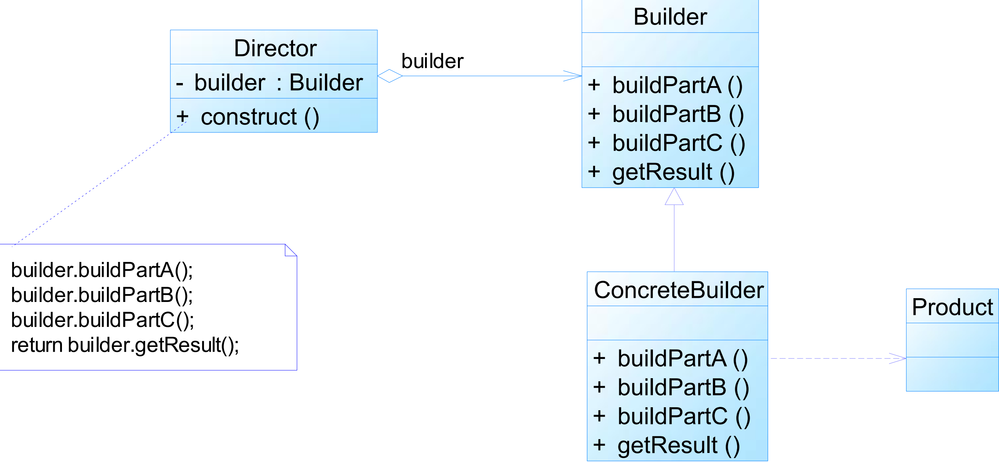

- Builder：抽象建造者为创建一个产品对象的各个部件指定抽象接口
- ConcreteBuilder：具体建造者实现了抽象建造者接口，实现各个部件的构造和装配方法，定义并明确它所创建的复杂对象，也可以提供一个方法返回创建好的复杂产品对象
- Director：指挥者负责安排复杂对象的建造次序，指挥者与抽象建造者之间存在关联关系，可以在其construct方法中调用建造者对象的部件构造与装配方法，完成复杂对象的建造
- Product：产品角色是被构建的复杂对象，包含多个组成部件

## 模式优缺点

### 模式优点

- 客户端不必知道产品内部组成的细节，将产品本身与产品的创建过程解耦，使得相同的创建过程可以创建不同的产品对象。
- 用户使用不同的具体建造者即可得到不同的产品对象。
- 可以更加精细地控制产品的创建过程。
- 增加新的具体建造者无须修改原有的代码，指挥者类针对抽象建造者类编程，系统扩展方便，符合“开闭原则”。

### 模式缺点

- 如果产品之间的差异性很大，则不适合使用建造者模式，因此其使用范围受到一定的限制。
- 如果产品的内部变化复杂，可能会导致需要定义很多具体建造者类来实现这种变化，导致系统变得很庞大。

## 适用环境

- 需要生成的产品对象有复杂的内部结构
- 需要生成的产品对象的属性相互依赖，需要指定其生成顺序
- 对象的创建过程独立于创建该对象的类。
- 隔离复杂对象的创建和使用，并使得相同的创建过程可以创建不同的产品对象。

## 模式扩展

### 模式简化

- 省略抽象建造者角色：如果系统中只需要一个具体建造者的话，可以省略掉抽象建造者。
- 省略指挥者角色：在具体建造者只有一个的情况下，如果抽象建造者角色已经被省略掉，那么还可以省略指挥者角色。

### 与抽象工厂对比

- 建造者模式返回一个组装好的完整产品，而抽象工厂模式返回一系列相关的产品，这些产品位于不同的产品等级结构，构成了一个产品族。
- 在抽象工厂模式中，客户端实例化工厂类，然后调用工厂方法获取所需产品对象，而在建造者模式中，客户端可以不直接调用建造者的相关方法，而是通过指挥者类 来指导如何生成对象，包括对象的组装和建造过程，它侧重于一步步构造一个复杂对象，返回一个完整的对象。

# 原型模式

原型模式(Prototype Pattern)：原型模式是一种对象创建型模式，用原型实例指定创建对象的种类，并且通过复制这些原型创建新的对象。  

原型模式的基本工作原理是通过将一个原型对象传给那个要发动创建的对象，这个要发动创建的对象通过请求原型对象拷贝原型自己来实现创建过程。

## 模式动机

在软件系统中，有些对象的创建过程较为复杂，而且有时候需要频繁创建，原型模式通过给出一个原型对象来指明所要创建的对象的类型，然后用复制这个原型对象的办法创建出更多同类型的对象，这就是原型 模式的意图所在。

## 模式结构

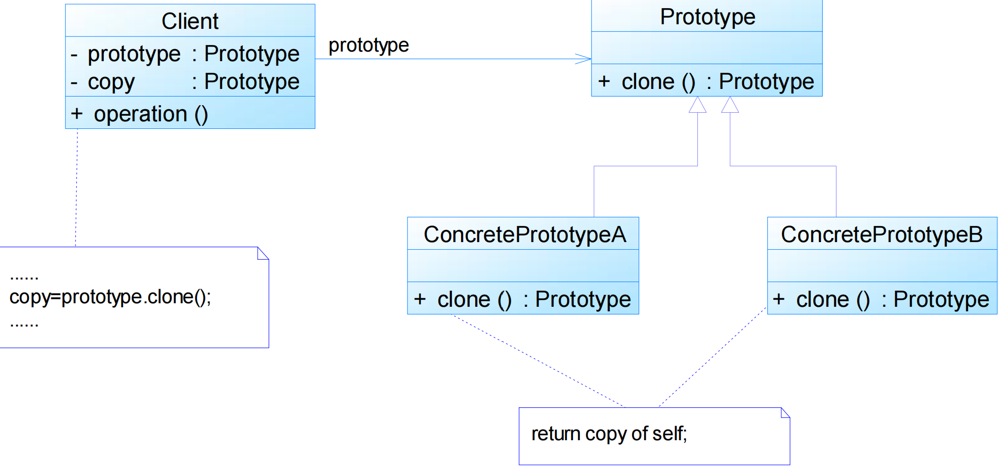

- Prototype：抽象原型类是定义具有克隆自己的方法的接口
- ConcretePrototype：具体原型类实现具体的克隆方法，在克隆方法中返回自己的一个克隆对象
- Client：在客户类中只需要直接实例化或通过工厂方法等方式创建一个对象，再通过调用该对象的克隆方法复制得到多个相同的对象

## 模式优缺点

### 模式优点

- 当创建新的对象实例较为复杂时，使用原型模式可以简化对象的创建过程，通过一个已有实例可以提高新实例的创建效率
- 扩展性较好，由于在原型模式中提供了抽象原型类，在客户端可以针对抽象原型类进行编程，而将具体原型类写在配置文件中，增加或减少产品类对原有系统都没有任何影响
- 原型模式提供了简化的创建结构，与工厂相比，省略了工厂结构
- 可以使用深克隆的方式保存对象的状态，使用原型模式将对象复制一份并将其状态保存起来，以便在需要的时候使用（如恢复到某一历史状态），可辅助实现撤销操作

### 模式缺点

- 需要为每一个类配备一个克隆方法，对已有类进行改造时，容易违反开闭原则
- 在实现深克隆时需要编写较为复杂的代码，而且当对象之间存在多重的嵌套引用时，为了实现深克隆，每一层对象对应的类都必须支持深克隆，实现起来可能会比较麻烦

## 适用环境

- 创建新对象成本较大
- 系统要保存对象的状态
- 需要避免创建一个与产品类层次平行的工厂类层次时

## 模式扩展

### 带原型管理器的原型模式

原型管理器(Prototype Manager)是将多个原型对象存储在一个集合中供客户端使用，它是一个专门负责克隆对象的工厂，其中定义了一个集合用于存储原型对象，如果需要某个原型对象的一个克隆，可以通过复制集合中对应的原型对象来获得。在原型管理器中针对抽象原型类进行编程，以便扩展。

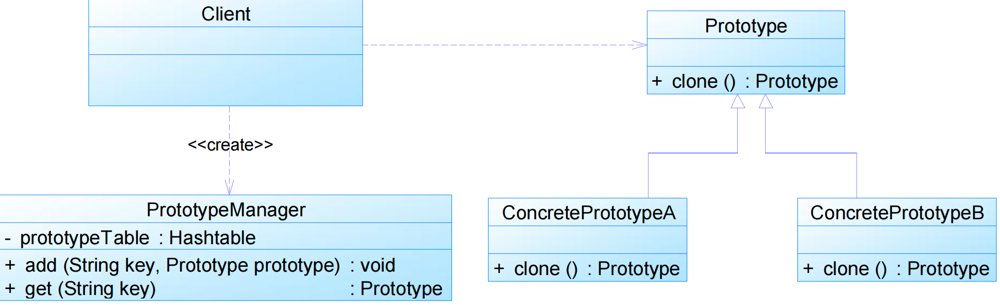

### 相似对象的复制

通过原型模式获得相同对象后可以再对其属性进行修改，从而获取所需对象。

# 单例模式

单例模式(Singleton Pattern)：单例模式确保某一个类只有一个实例，而且自行实例化并向整个系统提供这个实例，这个类称为单例类，它提供全局访问的方法。单例模式是一种对象创建型模式。单例模式又名单件模式或单态模式。

### 三个要点

- 某个类只能有一个实例
- 必须自行创建这个实例
- 必须自行向整 个系统提供这个实例

## 模式动机

对于系统中的某些类来说，只有一个实例很重要。   

定义一个全局变量可以确保对象随时都可以被 访问，但不能防止我们实例化多个对象。   

更好的解决办法是让类自身负责保存它的唯一实例。这个类可以保证没有其他实例被创建，并且它可以提供一个访问该实例的方法。这就是单例模式的模式动机。

## 模式结构

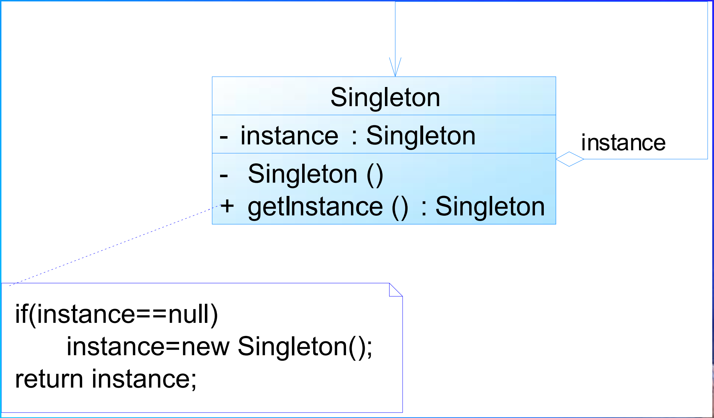

- Singleton：单例

### 注意点

- 单例类的构造函数为私有
- 提供一个自身的静态私有成员变量
- 提供一个公有的静态工厂方法

## 模式优缺点

### 模式优点 

- 提供了对唯一实例的受控访问。
- 可以节约系统资源
- 允许可变数目的实例

### 模式缺点

- 单例类的扩展有很大的困难
- 单例类的职责过重
- 滥用单例将带来一些负面问题

## 适用环境

- 系统只需要一个实例对象
- 客户调用类的单个实例只允许使用一个公共访问点
- 在一个系统中要求一个类只有一个实例时才应当使用单例模式。如果一个类可以有几个实例共存，就需要对单例模式进行改进，使之成为多例模式。

## 模式扩展

### 饿汉式单例类

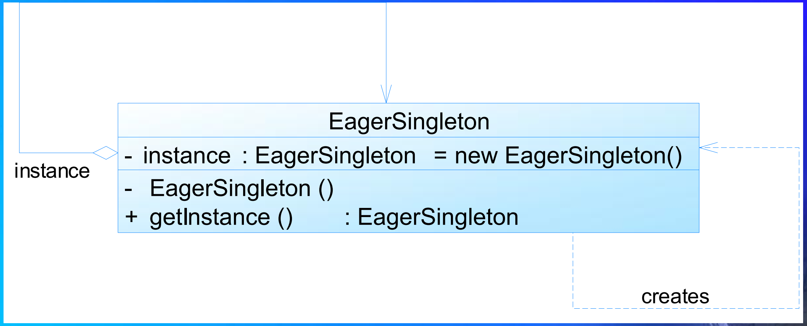

### 懒汉式单例类

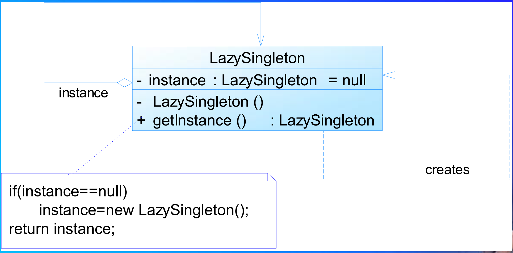

### 两者比较

- 饿汉式单例类在自己被加载时就将自己实例化。单从资源利用效率角度来讲，这个比懒汉式单例类稍差些。从速度和反应时间角度来讲，则比懒汉式单例类稍好些。
- 懒汉式单例类在实例化时，必须处理好在多个线程同时首次引用此类时的访问限制问题，特别是当单例类作为资源控制器，在实例化时必然涉及资源初始化，而资源初始化很有可能耗费大量时间，这意味着出现 多线程同时首次引用此类的机率变得较大，需要通过同步化机制进行控制。
