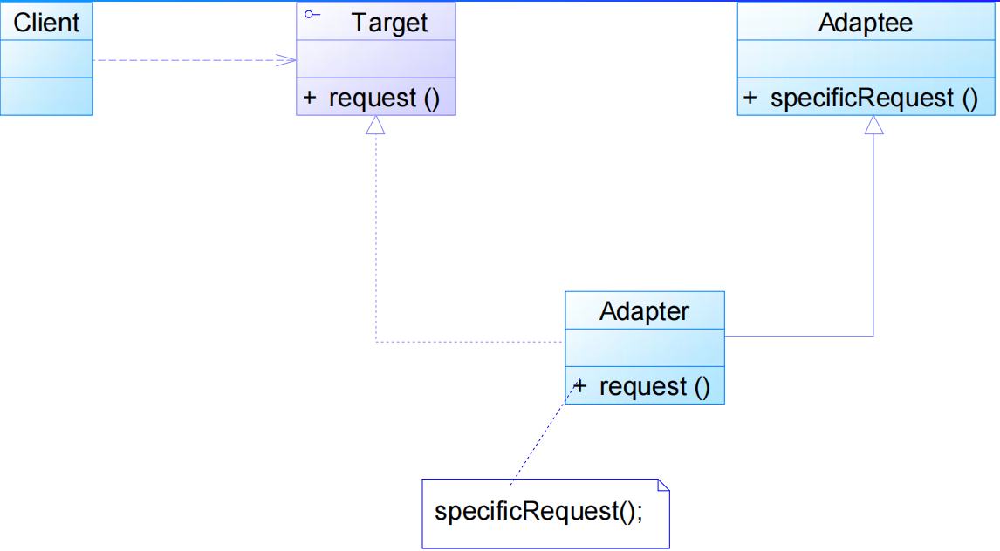
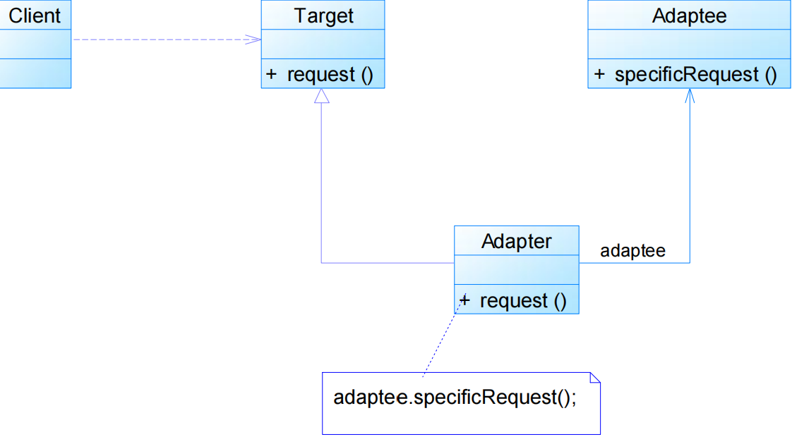
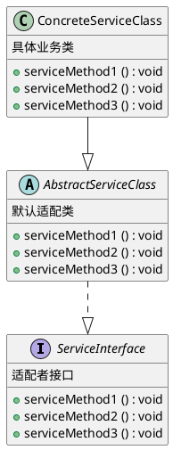
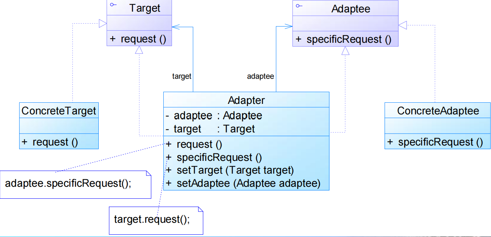
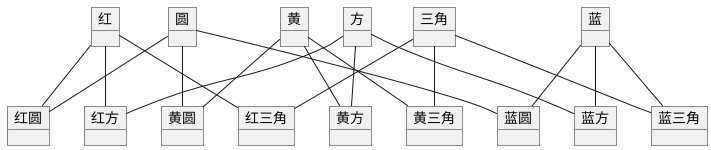
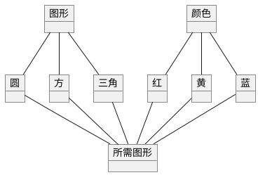
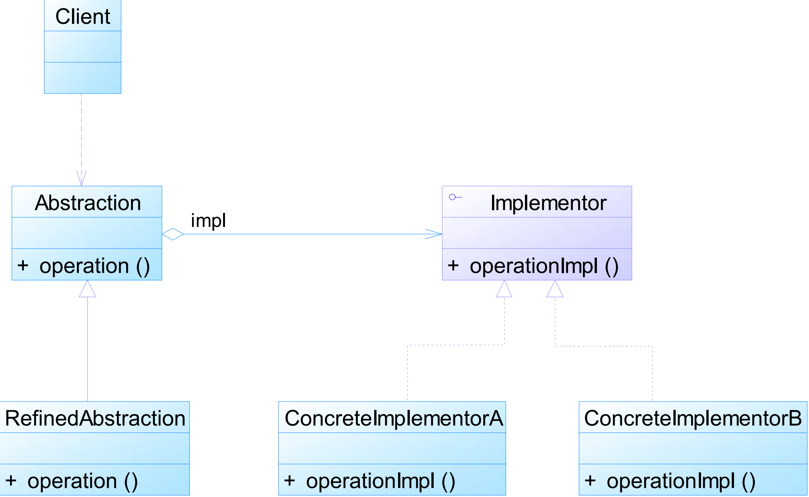
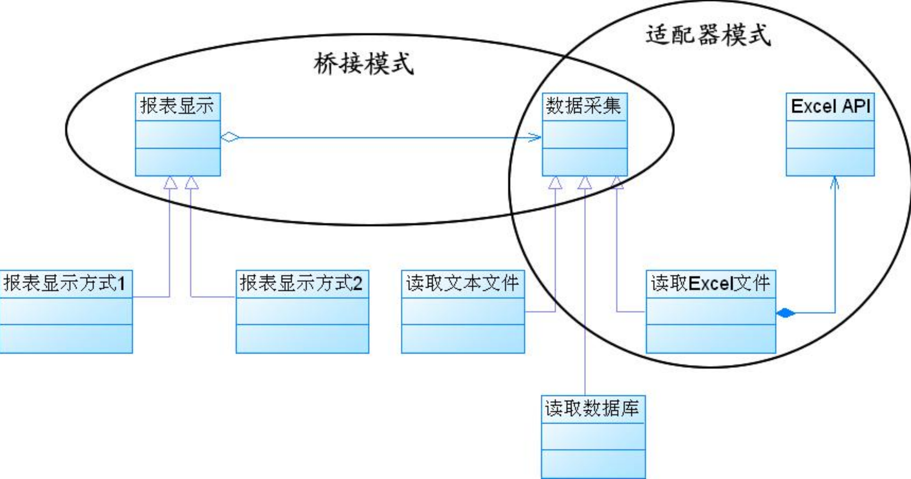

# 结构型模式

结构型模式(Structural Pattern)描述如何将类或者对象结合在一起形成更大的结构。  

## 类结构型模式和对象结构型模式

- 类结构型模式关心类的组合，由多个类可以组合成一个更大的系统，在类结构型模式中一般只存在继承关系和实现关系。
- 对象结构型模式关心类与对象的组合，通过关联关系使得在一个类中定义另一个类的实例对象，然后通过该对象调用其方法。根据“合成复用原则”，在系统中尽量使用关联关系来替代继承关系，因此大部分结构型模式都是对象结构型模式。

## 结构型模式包括

- [适配器模式](#适配器模式)
- [桥接模式](#桥接模式)
- [组合模式](#组合模式)
- [装饰模式](#装饰模式)
- [外观模式](#外观模式)
- [享元模式](#享元模式)
- [代理模式](#代理模式)

# 适配器模式

适配器模式(Adapter Pattern) ：将一个接口转换成客户希望的另一个接口，适配器模式使接口不兼容的那些类可以一起工作，其别名为包装器(Wrapper)。适配器模式既可以作为类结构型模式，也可以作为对象结构型模式。

## 模式动机

通常情况下，客户端可以通过目标类的接口访问它所提供的服务。有时，现有的类可以满足客户类的功能需要，但是它所提供的接口不一定是客户类所期望的，这可能是因为现有类中方法名与目标类中定义的方法名不一致等原因所导致的。   

在这种情况下，现有的接口需要转化为客户类期望的接口，这样保证了对现有类的重用。   

在适配器模式中可以定义一个包装类，包装不兼容接口的对象，这个包装类指的就是适配器(Adapter)，它所包装的对象就是适配者(Adaptee)，即被适配的类。   

适配器的实现就是把客户类的请求转化为对适配者的相应接口的调用。当客户类调用适配器的方法时，在适配器类 的内部将调用适配者类的方法，而这个过程对客户类 是透明的，客户类并不直接访问适配者类。因此，适 配器可以使由于接口不兼容而不能交互的类可以一起 工作。这就是适配器模式的模式动机。  

## 模式结构

### 类适配器

### 对象适配器

### 角色

- Target：目标抽象类定义客户所需接口，可以是一个抽象类或接口，也可以是具体类
- Adapter：适配器类可以调用另一个接口，作为一个转换器，对Adaptee和Target进行适配，适配器类是适配器模式的核心，在对象适配器中，它通过继承Target并关联一个Adaptee对象使二者产生联系
- Adaptee：适配者类即被适配的角色，它定义了一个已经存在的接口，这个接口需要适配，适配者类一般是一个具体类，包含了客户希望使用的业务方法，在某些情况下可能没有适配者类的源代码
- Client：客户类

## 模式优缺点

### 模式优点

- 将目标类和适配者类解耦
- 增加了类的透明性和复用性
- 灵活性和扩展性都非常好

#### 类适配器优点

- 由于适配器类是适配者类的子类，因此可以在适配器类中置换一些适配者的方法，使得适配器的灵活性更强。

#### 对象适配器优点

- 一个对象适配器可以把多个不同的适配者适配到同一个目标，也就是说，同一个适配器可以把适配者类和它的子类都适配到目标接口。

### 模式缺点

#### 类适配器缺点

- 其使用有一定的局限性，不能将一个适配者类和它的子类都适配到目标接口
  
#### 对象适配器缺点

- 与类适配器模式相比，要想置换适配者类的方法就不容易。

## 模式适用环境

- 系统需要使用现有的类，而这些类的接口不符合系统的需要。
- 想要建立一个可以重复使用的类(适配器类)，用于与一些彼此之间没有太大关联的一些类(目标类和适配者类)，包括一些可能在将来引进的类(适配者类的子类)一起工作。

## 模式扩展

### 默认适配器模式(Default Adapter Pattern)或缺省适配器模式

当不需要全部实现接口提供的方法时，可先设计一个抽象类实现接口，并为该接口中每个方 法提供一个默认实现（空方法），那么该抽象类的子类可有选择地覆盖父类的某些方法来实现需求，它适用于一个接口不想使用其所有的方法的情况。因此也称为单接口适配器模式。  

- 适配者接口是一个接口，通常在该接口中声明了大量的方法。
- 默认适配器类是缺省适配器模式的核心类，使用空方法的形式实现了在ServiceInterface接口中声明的方法。通常将它定义为抽象类，因为对它进行实例化没有任何意义。
- 具体业务类是缺省适配器类的子类，在没有引入适配器之前，它需要实现适配者接口，因此需要实现在适配者接口中定义的所有方法，而对于一些无须使用的方法也不得不提供空实现。在有了缺省适配器之后，可以直接继承该适配器类，根据需要有选择性地覆盖在适配器类中定义的方法。

### 双向适配器

在对象适配器的使用过程中，如果在适配器中同时包含对目标类和适配者类的引用，适配者可以通过它调用目标类中的方法，目标类也可以通过它调用适配者类中的方法，那么该适配器就是一个双向适配器。

# 桥接模式

桥接模式(Bridge Pattern)：将抽象部分与它的实现部分分离，使它们都可以独立地变化。它是一种对象结构型模式，又称为柄体(Handle and Body)模式或接口(Interface)模式。  

如果软件系统中某个类存在两个独立变化的维度，通过桥接模式可以将这两个维度分离出来，使两者可以独立扩展，让系统更加符合“单一职责原则”。

与多重/多层继承方案不同，桥接模式将两个独立变化的维度设计为两个独立的继承等级结构，并且在抽象层建立一个抽象关联，该关联关系类似一条连接两个独立继承结构的桥，故名桥接模式。  

桥接模式用抽象关联取代了传统的多重/多层继承，将类之间的**静态继承关系**转换为**动态的对象组合关系**，使得系统更加灵活，并易于扩展，同时有效控制了系统中类的个数。

## 模式动机

### 繁琐，复杂

### 简化，易懂

## 模式结构

- Abstraction：抽象类，用于定义抽象类的接口，一般是抽象类而不是接口，其中定义了一个Implementor（实现类接口）类型的对象并可以维护该对象，它与Implementor之间具有关联关系，它既可以包含抽象业务方法，也可以包含具体业务方法。
- RefinedAbstraction：扩充抽象类，扩充由Abstraction定义的接口，通常情况下它不再是抽象类而是具体类，它实现了在Abstraction中声明的抽象业务方法，也可以调用在Implementor中定义的业务方法。
- Implementor：实现类接口，定义实现类的接口，这个接口不一定要与Abstraction的接口完全一致，事实上这两个接口可以完全不同，一般而言，Implementor接口仅提供基本操作，对这些基本操作进行了声明，而具体实现交给其子类。通过关联关系，Abstraction中不仅拥有自己的方法，还可以调用到Implementor中定义的方法，使用关联关系来替代继承关系。
- ConcreteImplementor：具体实现类，具体实现Implementor接口，在不同的具体实现类中提供基本操作的不同实现，在程序运行时，具体实现类对象将替换其父类对象，提供给抽象类具体的业务操作方法。

## 模式优缺点

### 模式优点

- 分离抽象接口及其实现部分。桥接模式使用“对象间的关联关系”解耦了抽象和实现之间固有的绑定关系，使得抽象和实现可以沿着各自的维度来变化。
- 在很多情况下，桥接模式可以取代多重/多层继承方案，多重/多层继承方案违背了“单一职责原则”，复用性较差，且类的个数非常多，桥接模式是比继承方案更好的解决方法，它极大减少了子类的个数。
- 桥接模式提高了系统的可扩展性，在两个变化维度中任意扩展一个维度，都不需要修改原有系统，符合“开闭原则”。

### 模式缺点

- 桥接模式的使用会增加系统的理解与设计难度，由于关联关系建立在抽象层，要求开发者一开始就针对抽象层进行设计与编程。
- 桥接模式要求正确识别出系统中两个独立变化的维度，因此其使用范围具有一定的局限性，如何正确识别两个独立维度也需要一定的经验积累。

## 适用环境

- 如果一个系统需要在抽象化和具体化之间增加更多的灵活性，避免在两个层次之间建立静态的继承关系，通过桥接模式可以使它们在抽象层建立一个关联关系。
- “抽象部分”和“实现部分”可以以继承的方式独立 扩展而互不影响，在程序运行时可以动态将一个抽象化子类的对象和一个实现化子类的对象进行组合，即系统需要对抽象化角色和实现化角色进行动态耦合。
- 一个类存在两个（或多个）独立变化的维度，且这两个（或多个）维度都需要独立进行扩展。
- 对于那些不希望使用继承或因为多重/多层继承导致系统类的个数急剧增加的系统，桥接模式尤为适用。

## 模式扩展

### 适配器与桥接模式联用

在软件开发中，适配器模式通常可以与桥接模式联合使用。适配器模式可以解决两个已有接口间不兼容问题，在这种情况下被适配的类往往是一个黑盒子，有时候我们不想也不能改变这个被适配的类，也不能控制其扩展。适配器模式通常用于现有系统与第三方产品功能的集成，采用增加适配器的方式将第三方类集成到系统中。桥接模式则不同，用户 可以通过接口继承或类继承的方式来对系统进行扩展。    

桥接模式和适配器模式用于设计的不同阶段，桥接模式用于系统的初步设计，对于存在两个独立变化维度的类可以将其分为抽象化和实现化两个角色，使它们可以分别进行变化；而在初步设计完成之后，当发现系统与已有类无法协同工作时，可以采用适 配器模式。但有时候在设计初期也需要考虑适配器模式，特别是那些涉及到大量第三方应用接口的情况。

# 组合模式

# 装饰模式

# 外观模式

# 享元模式

# 代理模式